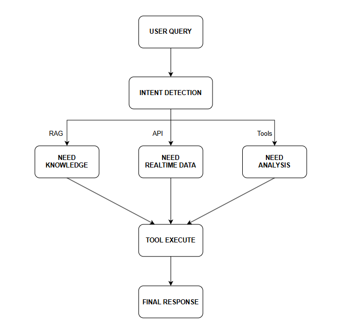

# 🚗 Car Agentic Chatbot

## 1. Introduction

Car Agentic Chatbot is an intelligent AI system built with an **Agentic AI architecture** to assist users in automotive-related tasks such as:

* Car recommendations
* Maintenance suggestions
* Polichy document retrieval
* Car information retrieval
* Filt cars by user's demand (price, seats, fuel type,...)
* Compare cars's differences

Unlike traditional chatbots, this system can **plan actions, call tools, and perform multi-step reasoning** to generate more accurate and context-aware responses.

---

## 2. Core Components

### 2.1 Agent (Core Brain)

* Powered by LLMs (Gemini / GPT / LLaMA)
* Capabilities:

  * Intent understanding
  * Multi-step planning
  * Tool selection and orchestration

### 2.2 Tool System

The agent interacts with external tools to extend its capabilities:

| Tool                | Function                     |
| ------------------- | ---------------------------- |
| Car Diagnostic Tool | Analyze vehicle issues       |
| Weather API         | Retrieve weather data        |
| Map API             | Suggest routes               |
| IoT Sensor          | Receive camera / sensor data |

---

### 2.3 RAG (Retrieval-Augmented Generation)

* Uses a Vector Database to store:

  * Car manuals
  * Repair guides
  * FAQs

**Flow:**

1. User query
2. Convert to embedding
3. Retrieve relevant documents
4. Inject into prompt
5. Generate final answer

---

## 3. Agentic Workflow

<p align="center">
  
</p>

**Workflow Explanation:**

1. The user submits a query
2. The agent detects the intent
3. The system plans required actions
4. It may call tools, APIs, or retrieve knowledge (RAG)
5. Results are aggregated
6. A final response is generated

---

## 4. Example Use Case

### Input:

"Tôi cần 1 chiếc xe 5 chỗ ngồi, động cơ xăng, tầm giá dưới 1 tỷ."

### Agent Behavior:

1. Detect intent: Ask recommendation
2. Plan actions:

   * List all customer's demands about the car
   * Retrieve most suitable cars from database
3. Combine results
4. Return:

   * List all the suitable cars
   * List cars's demanded information

---

## 5. Technologies Used

### 🔹 AI / ML

* LLMs: Gemini / GPT
* Embedding models
* Transformers

### 🔹 Backend

* Python
* FastAPI
* LangChain / Agent frameworks

### 🔹 Data

* Vector Database (FAISS / Chroma)

### 🔹 IoT Integration

* MQTT
* Camera (YOLO-based detection)

---

## 6. Installation & Setup

### 6.1 Clone Repository

```bash
git clone <repo>
cd car-agentic-chatbot
```

### 6.2 Install Dependencies

```bash
pip install -r requirements.txt
```

### 6.3 Environment Configuration (.env)

```env
API_KEY=your_api_key
MQTT_BROKER=your_broker
```

### 6.4 Run the System

```bash
uvicorn main:app --reload
```

---

## 7. Demo

### Use cases:

* Web chat interface
* IoT camera streaming
* Real-time AI detection and response

---

## 8. Evaluation

Evaluation is based on real-world demo scenarios:

* Response accuracy
* Multi-step reasoning capability
* Latency
* IoT integration performance

---

## 9. Future Work

* Multi-agent collaboration
* Voice assistant integration
* Predictive maintenance
* Domain-specific fine-tuning for automotive

---

## 10. Self-Learning Outcomes

During this project, the following skills were self-developed:

* Agentic AI architecture design
* RAG pipeline implementation
* AI + IoT integration

---

## 11. Conclusion

Car Agentic Chatbot represents a shift from traditional chatbots to **intelligent systems capable of reasoning and acting**, making it highly applicable to real-world automotive use cases.
